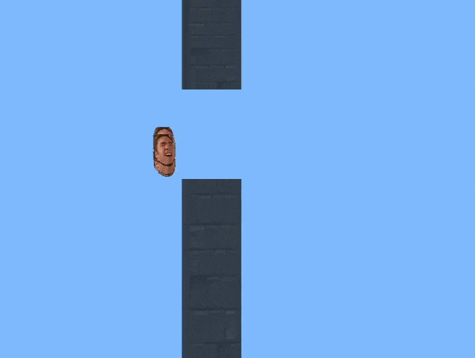

# Flappy Gachi


Flappy Gachi - neuroevolution flappy bird game made with just using pygame and numpy.

### Requirements
```python -m pip install numpy pygame```

### Run
After you install required libraries, just run `main.py` with a python3 interpreter.

### Usage
You can speed up the training process by pressing `left` and `right` arrow keys.
